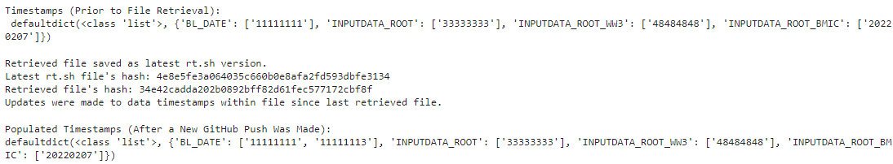

<h1 align="center">
UFS Weather Model Repository Develop Branch's Tracker for Populated Timestamped Datasets
</h1>

    

<h5 align="center">
    
[Prerequisites](#Prerequisites) • [Dataset](#Dataset) • [Quick Start](#Quick-Start) • [Status](#Status)
 • [What's Included](#What's-Included) • [Documentation](#Documentation) • [References](#Reference(s))

</h5>

# About

__Introduction:__

__Purpose:__

The purpose of this script is to 

__Capabilities:__

This script will be able to perform the following actions:

__Future Capabilities:__

# Table of Contents
* [Prerequisites](#Prerequisites)
* [Dataset](#Dataset)
* [Quick Start](#Quick-Start)
* [Status](#Status)
* [What's Included](#What's-Included)
* [Documentation](#Documentation)
* [References](#Creator(s))

# Prerequisites
* Python 3.9

# Dataset
* N/A

# Quick Start
* For demonstration purposes, refer to '.ipynb'

# Status

# What's Included
Within the download, you will find the following directories and files:
* Demo:
    > .ipynb
* Scripts:
    > .py
    > .py
    > .py
* List of Dependencies: 
    > git_env.yml

# Documentation

# References
* N/A

# Version:
* Draft as of 03/14/22

