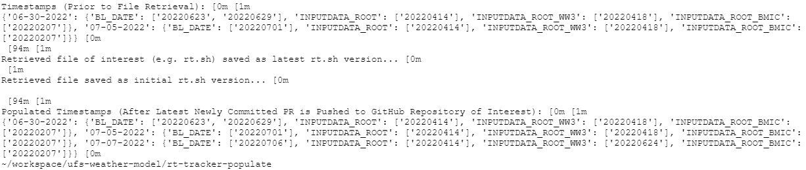

<h1 align="center">
UFS Weather Model Repository Develop Branch's Tracker for Populated Timestamped Datasets
</h1>

    

<h5 align="center">
    
[Prerequisites](#Prerequisites) • [Dataset](#Dataset) • [Quick Start](#Quick-Start) • [Status](#Status)
 • [What's Included](#What's-Included) • [Documentation](#Documentation) • [References](#Reference(s))

</h5>

# About

__Introduction:__
Currently, the NOAA development teams' code managers are maintaining their datasets manually via regularly checking if a UFS timestamp dataset is being revised, committed and pushed to the UFS-WM development branch repository to maintain datasets that will only support the latest two-months of development UFS-WM code. There are times when UFS timestamp datasets are unused as they exceed the latest two-months of development UFS-WM code window and are left on-prem. While the EPIC team continues to work in parallel with the NOAA development teams' devleopment in UFS-WM code, the UFS data tracker bot will be able to support the data management of only storing datasets supporting the latest two months of development UFS-WM code within its cloud data storage via automatically tracking of the revisions that are made against the UFS timestamp datasets. The data tracker bot will later be integrated with another script which will perform the 2 months window shift of datasets to maintain the NOAA development teams' code managers current practice stored data requirements.

__Purpose:__

The purpose of this script is to 
* Extract single file daily & parse
* Client makes a direct request for rt.sh from GitHub
* rt.sh is read, preprocessed & extracts the timestamps of the relevant datasets which has been pushed on GitHub.
* Generates a file containing the datasets' timestamps
* Program will compare the last log file with the most recent file containing the datasets' timestamps.

__Capabilities:__

This script will be able to perform the following actions:

__Future Capabilities:__

# Table of Contents
* [Prerequisites](#Prerequisites)
* [Dataset](#Dataset)
* [Quick Start](#Quick-Start)
* [Status](#Status)
* [What's Included](#What's-Included)
* [Documentation](#Documentation)
* [References](#Creator(s))

# Prerequisites
* Python 3.9

# Dataset
* N/A

# Quick Start
* For demonstration purposes, refer to '.ipynb'

# Status

# What's Included
Within the download, you will find the following directories and files:
* Demo:
    > .ipynb
* Scripts:
    > .py
    > .py
    > .py
* List of Dependencies: 
    > git_env.yml

# Documentation

# References
* N/A

# Version:
* Draft as of 03/14/22

